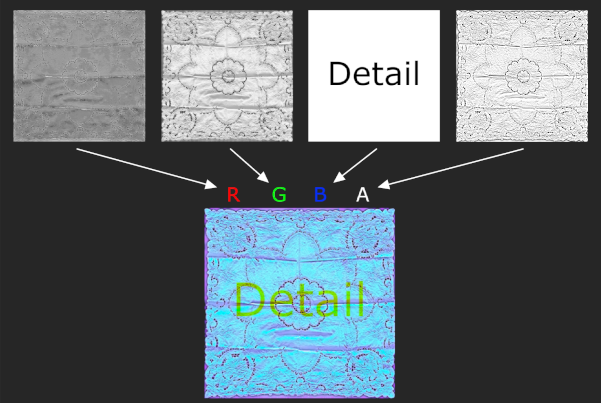

# Mask Map Tool
Mask Map Tool is a programme that enables you to create Mask Map textures the fast and convenient. [Mask Maps](https://docs.unity3d.com/Packages/com.unity.render-pipelines.high-definition@7.1/manual/Mask-Map-and-Detail-Map.html) are necessary for e.g. creating Materials for the High-Definition Render Pipeline of [Unity](https://unity.com/de/srp/High-Definition-Render-Pipeline). Mask Map Tool is currently available for Windows and Linux.
 
 

## How it works
Select the maps you want to be included in the mask map via drag and drop or the Select Path buttons and click the Save as button.  
 
Mask Map Tool then takes the greyscale textures (Metallic Map, Ambient Occllusion Map, Detail Mask and Smoothness Map) and merges them to a single texture, the mask map (see image below).
 
 

You will then find the generated mask map in the selected directory.

## Installation
Official releases can be downloaded from the [release page](https://github.com/WorldOfPaul/MaskMapTool/releases)  
- **Windows**: Download the *.zip* file and unzip it. It contains a *.exe* file you can just run.  
- **Linux**: Download the *.zip* file and unzip it. Open your terminal, change directory to the unzipped folder and type:  
`sudo chmod +x install.sh`  
`sudo ./install.sh`  
You can find the application in the applications menu.  

### How to uninstall
- **Windows**: Just delete the *.exe* file.  
- **Linux**: In the unzipped folder type:  
`sudo chmod +x uninstall.sh`  
`sudo ./uninstall.sh`  

If everything worked, you successfully uninstalled MaskMapTool  

## How to build Mask Map Tool
Requirements:
- [Python 3.9](https://www.python.org/downloads/) or higher. Older versions may work but have not been tested  
- Every python module listed in [requirements.txt](https://github.com/WorldOfPaul/MaskMapTool/requirements.txt)  
- Source code  
- I used [PyInstaller](https://pyinstaller.org/en/stable/), which can be installed with `pip install pyinstaller`
  - **Windows**: Open the Command Prompt and change directory to the source directory and type the following:  
    `pyinstaller MaskMapTool.py --noconfirm --onefile --windowed --icon "PathToMaskMapTool/Assets/mask_icon.ico" --add-data "PathToMaskMapTool/Assets;Assets/" --            add-data "PathToPyhtonSite-Packages/tkinterdnd2;tkinterdnd2/"`  
  - **Linux**: Open the Terminal and change directory to the source directory and type the following:  
    `pyinstaller MaskMapTool.py --onefile --windowed --hidden-import="PIL._tkinter_finder" --add-data "PathToMaskMapTool/Assets/:Assets" --add-data "PathToPythonSite-      Packages/tkinterdnd2/:tkinterdnd2"`  
- If the build was successful you can find an executable inside the "dist" folder.

## How to help
Building MaskMapTool for macOS would be great, because macOS is not supported yet.

